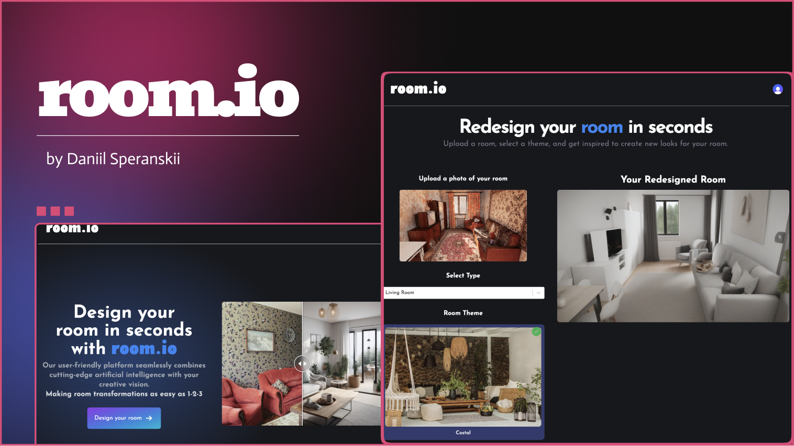

# [Room.io 🔗](https://room-io.netlify.app/)

Room,io is an innovative web application that leverages the power of AI to reimagine your living spaces. Using a seamless integration with Replicate AI, Room,io offers a user-friendly platform to visualize room transformations before they happen.
 ## Features  - 
  - **AI-Powered Design**: Transform your room with the help of advanced AI algorithms. 
  -  **Clerk Authentication**: Secure sign-in process to protect your data and privacy.
   -  **Image Uploads**: Easy upload of room photos with ByteScale for accurate AI redesigns. 
   -  **Custom Room Types**: Whether it's a bedroom, living room, kitchen, or bathroom, Room,io handles them all. 
   -  **Themed Redesigns**: Select from a variety of design themes to match your style and preference. 
   -  **Real-time Generation**: Instantly generate a new room design with just a click. 
   
  ## Getting Started  
  To get started with Room,io, simply follow these steps: 
  1. Visit the landing page to learn more about how Room,io can transform your space. 
  2. Sign in using the secure Clerk authentication process. 
  3. Once signed in, you'll be redirected to the room generation page. 
  4. Upload a photo of your room using the ByteScale upload feature. 
  5. Select the type of room you want to redesign. 
  6. Choose your desired theme for the new room design. 
  7. Press "Generate" and watch as Replicate AI works its magic, creating a new room based on your specifications. 
  
  ## Technologies  
  Room,io is built with the latest web technologies to ensure a smooth and responsive experience: 
-  **Next.js 14**: For server-side rendering and static site generation.
 -  **Tailwind CSS**: For stylish and responsive design elements. 
-  **Zustand**: For efficient state management across the app. \

## Support  
For support, please open an issue on our GitHub repository or contact our support team. 
## License
  Room.io is licensed under the [MIT License](LICENSE). Enjoy transforming your rooms with Room.io!